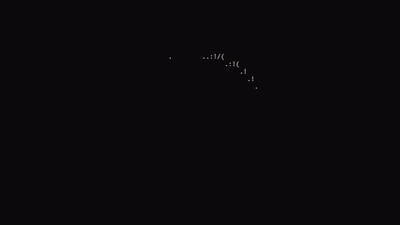

# Console 3D Rotating Sphere

This is a fun hobby project that renders a 3D rotating sphere directly in the console using ASCII characters. Written in C/C++, this project demonstrates basic 3D graphics concepts and creative use of console output.

## Features
- Real-time rotation of a 3D sphere.
- ASCII art for rendering in the console.
- Simple and lightweight code.
